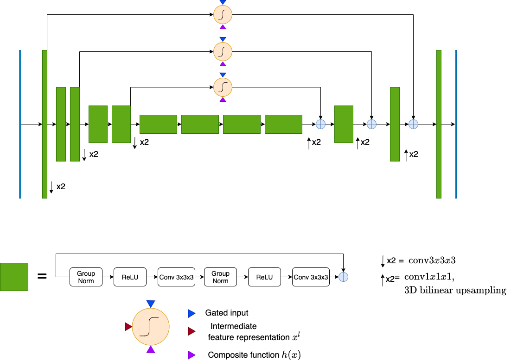
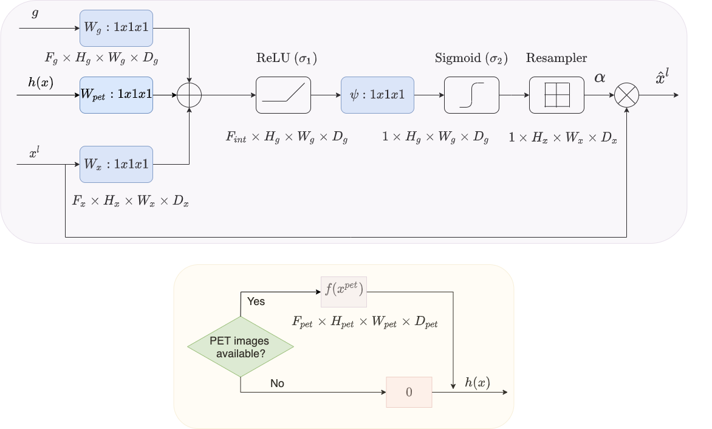

# PET Guided Attention Network for segmentation of lung tumors from PET/CT images that accounts for missing PET images  

This project is my part of my master thesis at ETH Zurich, Switzerland. 

-- Project Status : [Completed]

## Introduction 
 
PET Guided Attention Network is a novel deep learning model for segmentation of lung tumors from PET/CT images that  
can account for missing PET images. It is based on a novel PET Guided Attention Gate (PAG). 

The following Figures show the architecture of the network and the attention gate respectively.   

   



  
  ## Prerequisites 

The Baseline models require conda environment. Main dependencies are:
* PyTorch (GPU)
* cv2 (OpenCV)
* cc3d (See [https://github.com/seung-lab/connected-components-3d])

Further, dependencies can be found in the environemnt.yml

### Conda environment  
Create the conda environment
     
```bash
conda env create -f environment.yml
```

## Usage
### Data pre-processing

To pre-process the data and generate data augmentations run
```bash
> python data/data_preprocessing.py --save_dir tumor_data/ --data_aug
``` 

```
usage: Data pre-processing for PAG model [-h] [--anim] [--save_dir SAVE_DIR]
                                         [--data_aug]

optional arguments:
 -h, --help           show this help message and exit
  --anim               Generate animations of pre-processed images?
  --save_dir SAVE_DIR  Where to save data?
  --data_aug           Should perform data augmentation?

```

### Train + Valid + Test

The configurations are set according to defined in config.json file 
``` bash
> python -u loader.py --config config.json --train # To train the model
> python -u loader.py --config config.json --valid # To generate predictions on validation data 
> python -u loader.py --config config.json --test # To generate predictions on test data

```
To submit the job on LSF batching system. The model reuqires GPU for training, validation and testing
```
> bsub -o output.txt -W 48:00 -R "rusage[mem=15000,ngpus_excl_p=1]" -R "select[gpu_mtotal0>=14000]" python -u loader.py --train  
```

```
usage: Segmentation of lung tumors PAG model and baselines [-h]
                                                           [--config CONFIG]
                                                           [--method METHOD]
                                                           [--train] [--valid]
                                                           [--test]
                                                           [--exp_name EXP_NAME]
                                                           [--save_dir SAVE_DIR]
                                                           [--ckpt_file CKPT_FILE]
                                                           [--fold FOLD]
                                                           [--n_folds N_FOLDS]
                                                           [--n_epochs N_EPOCHS]
                                                           [--lr LR]

optional arguments:
  -h, --help            show this help message and exit
  --config CONFIG       Configuration file
  --method METHOD       Which model?
  --train               Train the model?
  --valid               Train the model?
  --test                Train the model?
  --exp_name EXP_NAME   Name of the experiment
  --save_dir SAVE_DIR   Where do you want to save ?
  --ckpt_file CKPT_FILE
                        Optional path for checkpoint
  --fold FOLD           Fold no. in CV experiments
  --n_folds N_FOLDS     No. of folds
  --n_epochs N_EPOCHS   Number of epochs
  --lr LR               learning rate
```

## Analyze the results

### Generate the metrics for experiments
To calculate metrics on validation dataset.  
```
python validate/validate.py --dirs multi-baselines/ct/cv0/ --detect --analyze --valid ;
```

```
usage: Data analysis [-h] --dirs DIRS [DIRS ...] [--anim] [--analyze]
                     [--detect] [--train] [--valid] [--test] [--config CONFIG]
                     [--clusters CLUSTERS]

optional arguments:
  -h, --help            show this help message and exit
  --dirs DIRS [DIRS ...]
                        All the directories you want
  --anim                Do you want animations?
  --analyze             Calculate metrics?
  --detect              Generate metrics?
  --train               Analyze for training data?
  --valid               Analyze for validation data?
  --test                Analyze for test data?
  --config CONFIG       json file
  --clusters CLUSTERS   Name of the file to store summary statistics
```

To generate the CV metrics for a directory
```
python validate/cv_analyze.py --dir multi-baselines/ct/;
```

### PAG model results when complete PET/CT data
```
python validate/dir_analyze.py --dirs \
multi-baselines/ct/ \
multi-baselines/ct_attn/ \
pag/less/complete/PAG-ct/ \
pag/less/complete/PAG-ct-pet/ \
pag/fractions/complete/ \
multi-baselines/bimodal_attn/ --save_dir metrics_plots_v1/
```

## PAG model results fractions

```
python validate/rstr_analyze.py --save_dir metrics_plots_v1/
```


